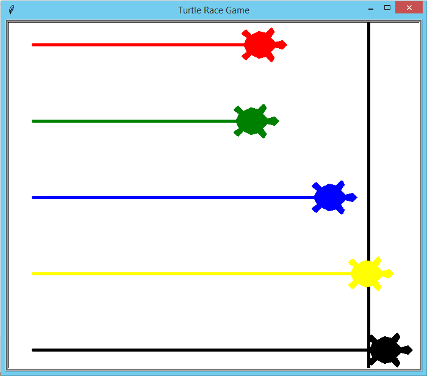

# More Beginner Projects
More 5 Beginner Python Projects
## Table of contents
* [Introduction](#introduction)
* [Projects](#projects)
* [License](#license)
## Introduction
After creating a repository with [five beginner projects for someone learning Python](https://github.com/LFuciarelli/beginner-projects) during the COVID-19 quarantine, I decided to do more five projects. This time the projects ideas came from a [video](https://www.youtube.com/watch?v=1HHRWg--Ce4) of the channel Tech With Tim.

`Disclaimer:` I highly recommend you to try to solve these projects by yourself before looking at the solutions. Practice is very important in programming.
## Projects
### 1. Login system
Create a page where the person can create an account or login. In the first case, you ask them for an e-mail, a username, two passwords and store the information in a text file or database. In the second one, ask the person for a username and a password.

**Sources:**

This [tutorial](https://www.datacamp.com/community/tutorials/pickle-python-tutorial) from DataCamp shows how to use the Pickle module to save your data in a file using Python.

This [video tutorial](https://www.youtube.com/watch?v=lFRMdGfo_XA) from the channel NeuralNine shows how to create a SQLite database using Python.

### 3. Excel module
Create an application that tracks your expenses through the command prompt, where the person type what the expense was, how much it costed and what day it was on and add that information that to an excel spreadsheet.

**Sources:**

This [tutorial](https://realpython.com/openpyxl-excel-spreadsheets-python/#writing-excel-spreadsheets-with-openpyxl) from RealPython explains how to work with Excel spreadsheets using the package openpyxl.

### 4. Turtle module
Create a “turtle race” game. When the player hits space, the turtles start running and then keep track of which one won in a text file for scores.

**Turtle Race Game**

**Sources:**

I used the [documentation](https://docs.python.org/3/library/turtle.html) of the module to write the code, but you can also check out this [playlist](https://www.youtube.com/watch?v=p7CiFhiTdvY&list=PLzMcBGfZo4-kfGgYZb9dwW3VhoBRG0h9c) from the channel Tech With Tim to learn how to use it.

### 5. Tic-Tac-Toe
Create a tic-tac-toe game. The player can play against the computer, which can make either random moves or logical moves, or another person. 

I created two versions: one in which two human players play against each other and another in which the human player plays against the computer, which makes logical moves using the minimax algorithm.

**Sources:**

The website "never stop building" has an amazing [explanation](https://www.neverstopbuilding.com/blog/minimax) of the minimax algorithm. In addition to it, I used this [tutorial](https://www.geeksforgeeks.org/minimax-algorithm-in-game-theory-set-3-tic-tac-toe-ai-finding-optimal-move/) from GeeksforGeeks to implement my version of the minimax algorithm.

## License

This project is licensed under the MIT License - open the [LICENSE.md](https://github.com/LFuciarelli/more-beginner-projects/blob/master/LICENSE.md) file for more details.
